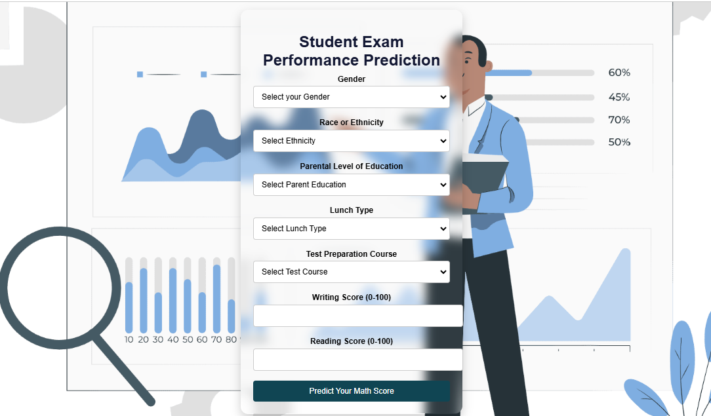

# Student Performance Prediction

 

📌 **Problem Statement**

This project aims to  analyze how students' academic performance (test scores) is influenced by various factors such as Gender, Ethnicity, Parental Level of Education, Lunch Type, and Test Preparation Course. The goal is to build predictive models that estimate students' scores based on these variables.

📊 **Data Collection**

**Dataset Source:** Kaggle - Students Performance in Exams

### Features Description:

| Feature                         | Description                                                                                                          |
| ------------------------------- | -------------------------------------------------------------------------------------------------------------------- |
| **gender**                      | Sex of students (Male/Female)                                                                                        |
| **race/ethnicity**              | Ethnicity of students (Group A, B, C, D, E)                                                                          |
| **parental level of education** | Parents' highest education level (Bachelor's degree, Some college, Master's degree, Associate's degree, High school) |
| **lunch**                       | Lunch type before test (Standard/Free or Reduced)                                                                    |
| **test preparation course**     | Completion status (Completed/Not Completed)                                                                          |
| **math score**                  | Score in Mathematics                                                                                                 |
| **reading score**               | Score in Reading                                                                                                     |
| **writing score**               | Score in Writing                                                                                                     |

**Dataset Summary:**

- 8 columns, 1000 rows
- Means of numerical features range between 66 and 68.05
- Standard deviations range between 14.6 and 15.19
- Minimum math score: 0, Minimum writing score: 10, Minimum reading score: 17

📈 **Model Performance Comparison**

| Model                       | RMSE (Train) | MSE (Train) | MAE (Train) | R² Score (Train) | RMSE (Test) | MSE (Test) | MAE (Test) | R² Score (Test) |
| --------------------------- | ------------ | ----------- | ----------- | ---------------- | ----------- | ---------- | ---------- | --------------- |
| **Linear Regression**       | 2.0656       | 28.3349     | 4.2667      | 0.8743           | 2.0530      | 29.0952    | 4.2148     | 0.8804          |
| **Lasso Regression**        | 2.2817       | 43.4784     | 5.2063      | 0.8071           | 2.2711      | 42.5064    | 5.1579     | 0.8253          |
| **Ridge Regression**        | 2.0652       | 28.3378     | 4.2650      | 0.8743           | 2.0521      | 29.0563    | 4.2111     | 0.8806          |
| **K-Neighbors Regressor**   | 2.1254       | 32.5934     | 4.5175      | 0.8554           | 2.3742      | 52.6834    | 5.6370     | 0.7835          |
| **Decision Tree Regressor** | 0.1369       | 0.0781      | 0.0187      | 0.9997           | 2.4259      | 54.8350    | 5.8850     | 0.7747          |
| **Random Forest Regressor** | 1.3545       | 5.3610      | 1.8348      | 0.9762           | 2.1446      | 35.7390    | 4.5994     | 0.8531          |
| **XGBRegressor**            | 0.8291       | 1.0146      | 0.6875      | 0.9955           | 2.2489      | 41.9037    | 5.0577     | 0.8278          |
| **AdaBoost Regressor**      | 2.1809       | 34.0218     | 4.7562      | 0.8491           | 2.1457      | 35.4807    | 4.6041     | 0.8542          |

🔍 **Insights & Key Findings**

- **Linear Regression** & **Ridge Regression** performed the best with an R² score above 0.88.
- **Decision Tree Regressor** overfitted the training data, leading to a poor test performance.
- **Random Forest** & **XGBRegressor** showed good generalization but were slightly less efficient than Ridge Regression.
- **Lasso Regression** had the lowest performance, making it unsuitable for this dataset.
- **K-Neighbors Regressor** and **AdaBoost** performed moderately, but their R² scores suggest they are not optimal for this problem.


🛠️ **How to Run the Project**

1. Clone the repository:

   ```bash
   git clone https://github.com/Mazenasag/End-to-end student performance prediction system.git
   cd student-performance-prediction
   ```

   Install dependencies:

bash
Copy
Edit
pip install -r requirements.txt
Run the application:

bash
Copy
Edit
python app.py
Open your browser and go to http://127.0.0.1:5000/

Input student data and get predictions on test scores.

🚀 Future Enhancements

Deploy the model as an interactive web app (using Flask/Streamlit)
Optimize hyperparameters using GridSearchCV
Implement deep learning models for better accuracy
Enhance feature engineering to improve predictions
👥 Contributors

[Mazen Asag]

📜 License

This project is licensed under the MIT License.

Feel free to contribute and improve the model! 🚀
d